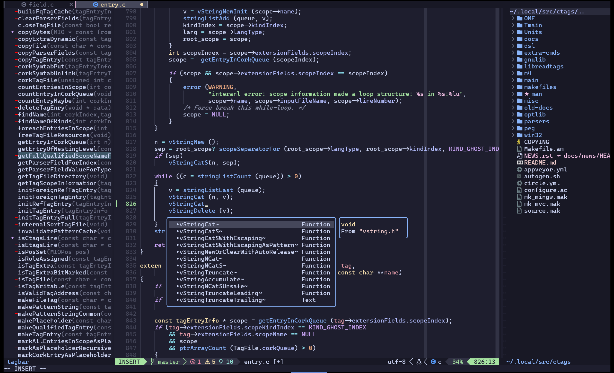
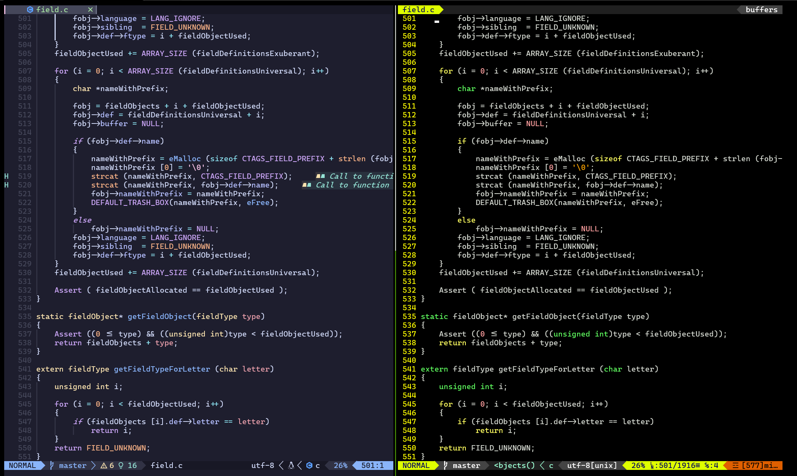
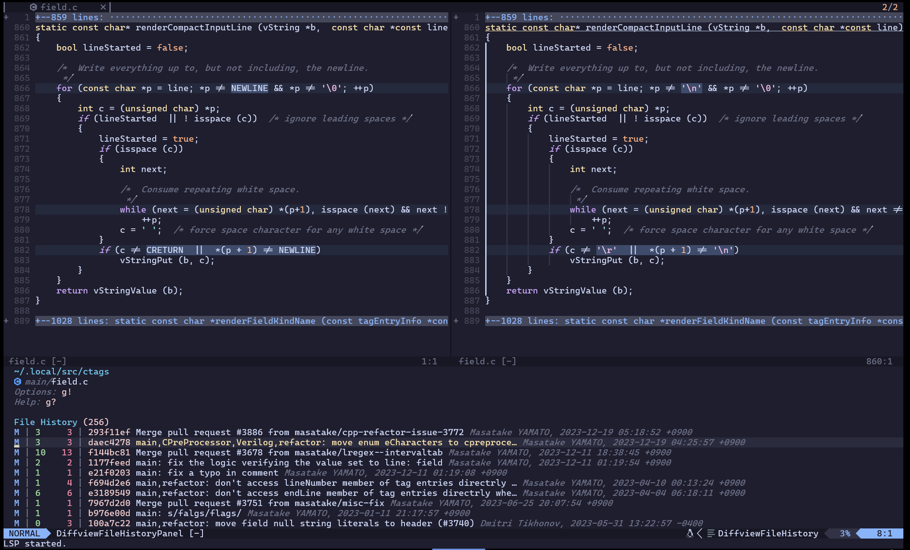
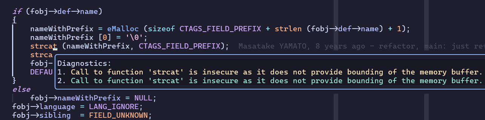
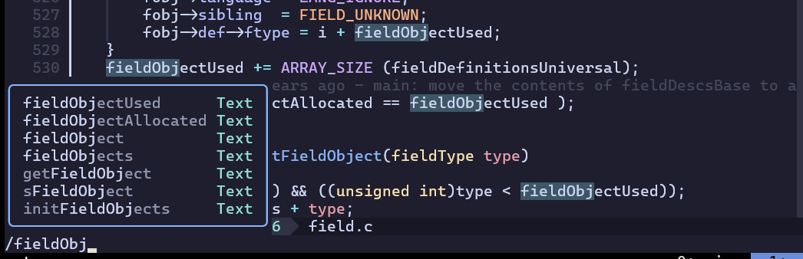
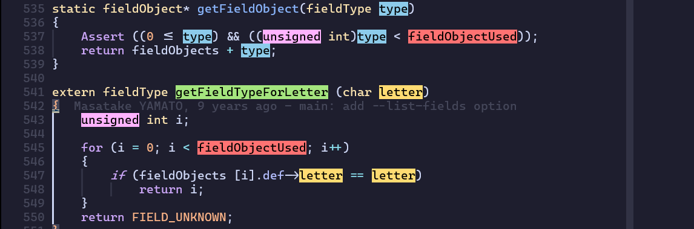
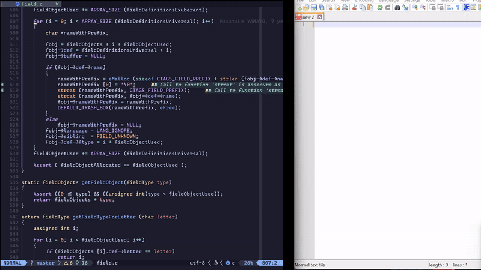
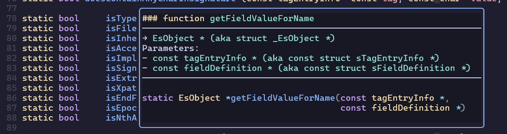

# NVIM Studio




## Features

* LSP support that provides much better experience than cscope and ctag.

* Better highlighting

  

  Treesitter-based highlighting (left) vs Traditional highlighting (right)

* Git Integration

  

* Static analysis

  

* Auto completion

  

* Highlight marker

  

* Yank to the system clipboard and vice versa

  


## Prerequisites

You should set up a good environment to make your NVIM life easier. NVIM Studio is running in the following environments:

* Ubuntu 20.04 or above

* [Windows Terminal](https://docs.microsoft.com/en-us/windows/terminal/get-started)

* Set [CaskaydiaCoveNerdFont-Regular.ttf](https://github.com/ryanoasis/nerd-fonts/releases/download/v3.2.1/CascadiaCode.zip) by default to your terminal.


## Setting up the Environment

1. Install the following packages. It could be a overkill to install all packages. Some of them might not be necessary depending on your environment. However, note that if you encounter any unexpected symptom throughout this guide, come back here and see what is missing.

   ```bash
   sudo apt install ssh keychain make cmake python3-cryptography clang-format automake autoconf pkg-config python3-pip clang libtool-bin npm curl build-essential unzip gettext ninja-build clang-tidy
   ```

2. Install [universal-ctags](https://github.com/universal-ctags/ctags)

   ```bash
   sudo apt-get install libjansson-dev
   mkdir ~/.local/src; cd ~/.local/src
   git clone https://github.com/universal-ctags/ctags.git --depth=1
   cd ctags
   ./autogen.sh
   ./configure --prefix=$HOME/.local/
   make
   make install

3. Install tmux

   I strongly recommend using tmux if you haven't already. If you have a root privilege, `sudo apt install tmux` will do. If the version is lower than 3.2a in your Ubuntu or if you don't have a root privilege, you may as well build tmux >= 3.2a to enjoy true color. libevent and ncurses are prerequisites. See [this page](https://github.com/tmux/tmux/wiki/Installing). I describe the tmux build command as an example as follows:

   ```bash
   cd ~/.local/src
   git clone https://github.com/tmux/tmux.git
   cd tmux
   ./autogen.sh
   ./configure --prefix=${ROOT_DIR}/.local CFLAGS="-I${ROOT_DIR}/.local/include -I${ROOT_DIR}/.local/include/ncurses" LDFLAGS="-L${ROOT_DIR}/.local/include -L${ROOT_DIR}/.local/include/ncurses -L${ROOT_DIR}/.local/lib"
   make && make install
   ```

   Install tpm (Tmux Plugin Manager)

   ```bash
   cd
   wget https://github.com/guru245/dotfiles/blob/main/.tmux.conf
   wget https://github.com/guru245/dotfiles/blob/main/truecolor-test
   cd ~/.local/src
   git clone https://github.com/tmux-plugins/tpm ~/.tmux/plugins/tpm
   tmux
   ```

   Press `<leader>a`, i.e., `Ctrl+a` and then press `I` (captital) to install tmux plugins. You may want to run [`truecolor-test`](https://github.com/guru245/dotfiles/blob/main/truecolor-test) to check if true color is working correctly.

4. Install misc packages for Neovim

   ```
   sudo apt install ripgrep fzf fd-find bear
   ln -s $(which fdfind) ~/.local/bin/fd
   ```


## Installing Neovim

```bash
sudo apt install ninja-build gettext cmake unzip curl build-essential
cd ~/.local/src
git clone https://github.com/neovim/neovim
cd neovim
git checkout tags/v0.10.1
make distclean <- if necessary
make deps <- if necessary
make CMAKE_EXTRA_FLAGS="-DCMAKE_INSTALL_PREFIX=$HOME/.local" CMAKE_BUILD_TYPE=Release
make install
pip3 install pynvim
```


## Installing NVIM Studio

```bash
cd ~/.local/src
git clone https://github.com/guru245/nvim-studio.git
cd
mkdir .config
ln -s ~/.local/src/nvim-studio/nvim ~/.config/nvim/
Note https://github.com/junegunn/vim-plug/wiki/tips#automatic-installation
or
sh -c 'curl -fLo "${XDG_DATA_HOME:-$HOME/.local/share}"/nvim/site/autoload/plug.vim --create-dirs https://raw.githubusercontent.com/junegunn/vim-plug/master/plug.vim'
nvim <-- Ignore errors that you see while running nvim.
:PluginInstall in nvim
:qa
nvim <-- Ignore an error that you see while running nvim
:LspInstall lua_ls
:LspInstall clangd
```


## Setting up LSP

Before you dive in, you need to understand how to utilize LSP (Language Server Protocol). To fully utilize LSP, you need to create `compile_commands.json`. `compile_commands.json` can be created by *bear*. You can [see how to use *bear*](https://github.com/rizsotto/Bear?tab=readme-ov-file#how-to-use). When you succeed in creating the json file, you are ready to move on.

Next, you must install a language server that fits your needs. While installing NVIM studio, you've seen `:LSPInstall clangd`. The LSP is used for C and C++. If you want to use the other programming language, you need to install the other LSP that supports the language. You can find the list [here](https://github.com/williamboman/mason-lspconfig.nvim?tab=readme-ov-file#available-lsp-servers).

After installing the LSP, you need to specify the LSP name in init.lua as follows:

```lua
local servers = {
  'clangd',
  'rust_analyzer',
  'pylsp',
  'lua_ls',
  'cmake',
}
```


## Basic Usage

* `F1`: Empty

* `F2`: Save the current file

* `F3`: Toggle tagbar, source code browser on the left side

* `F4`: Toggle nvim-tree, file system explorer on the right side

* `F5`: Toggle diffview that shows differences against the current index

* `F6`: Toggle file history view that allows you to list all the commits.

* `F7`: Empty

* `F8`: Clear all marks

* `F9`: Empty

* `F10`: Empty

* `ctrl+h`, `ctrl+l`: Go to the tab on the left/right

* `alt+h`, `alt+l`, `alt+k`, `alt+j`:  Move between nvim panes

* `,w`: Save and close the current buffer.

* `<leader>p`: Toggle paste option. This is useful if you want to cut or copy
  some text from one window and paste it in nvim. Don't forget to toggle paste
  again once you finish pasting.

* `<leader>m`: Mark the keyword under the cursor. See more mappings [here](https://github.com/inkarkat/vim-mark?tab=readme-ov-file#usage)

* `K`: Shows a function prototype in a pop up.

  

* `[d` and `]d`: Prev/Next diagnostic message.

* `<C-W>d`: `vim.diagnostic.open_float()`

  


## Tmux Usage

You can find the intuitive mappings [here](https://github.com/tmux-plugins/tmux-pain-control).


## Nvim-tree Usage

Press `?` to see a help screen that shows all mappings.


## Gitsigns Usage

This plugin is convenient to stage, reset and navigate hunks. Check out the [keymaps](https://github.com/lewis6991/gitsigns.nvim?tab=readme-ov-file#keymaps)


## Diffview Usage

Diffview allows you to cycle through diffs for all modified files for any git rev, not to mention super convenient to resolve all conflicts. You can start Diffview by pressing `<F5>`. Once you get in, you can press `g?` to see all mappings.


## Telescope Usage

Telescope helps you navigate the code. To perform telescope searching, refer to the following keymaps:

| keymap | desc |
|--------|------|
| `<leader>ff` | Lists files in your current working directory, respects .gitignore |
| `<leader>fb` | Open Telescope file browser |
| `<leader>lg` | Search for a string in your current working directory and get results live as you type |
| `<leader>cs` | Lists LSP references for word under the cursor |
| `<leader>cg` | Goto the definition of the type of the word under the cursor |
| `<leader>cc` | Lists LSP incoming calls for word under the cursor |
| `<leader>ct` | Searches for the string under your cursor or selection in your current working directory |

For the file browser mappings, see [here](https://github.com/nvim-telescope/telescope-file-browser.nvim?tab=readme-ov-file#mappings). Note that `goto_parent_dir` is mapped to `u` due to the conflict between Telescope and file browser. The bug report has been submitted.

For the other Telescope mappings, see [here](https://github.com/nvim-telescope/telescope.nvim?tab=readme-ov-file#default-mappings).
